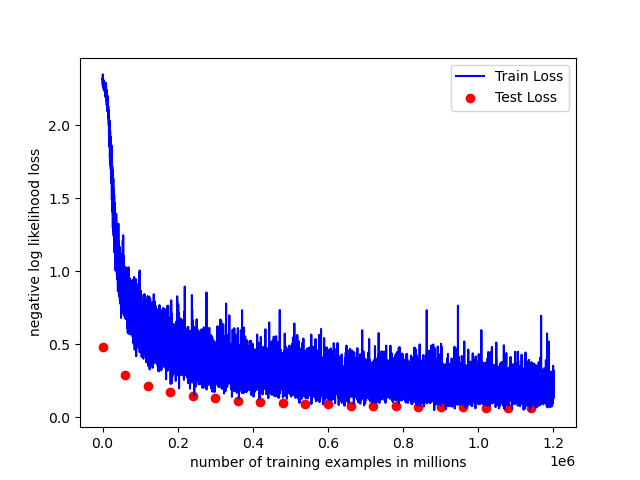
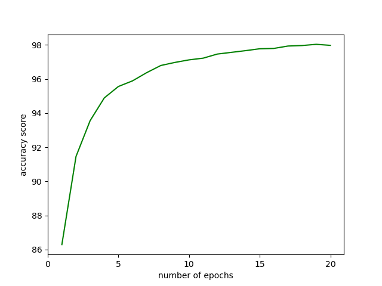

# recruitment_task 

## Description
Microservice realising number classification based on MNIST dataset.

### Dependencies
Project requires `py-torch`, `matplotlib`, `cuda-toolkit`

### Instalation & Run
Launch `run_sample.sh` to test sample image.

### Training script & accuracy
To train your own network run `main.py`. Arguments' list:
`--use_cuda` - Determine CUDA training, default is false
`--batch_size` - Input batch size, default = 100
`--lr` - Input learning rate, default = 0.01
`--n_epochs` - Input number of epochs, default = 20

### Scores review

As the plots show, after 20 epochs loss and accuracy alike get visibly asymptotic, which indicate reaching their local extrema  .
### Sidenotes

`build.sh` file was an attempt to install CUDA toolkit via bash script. It currently is not working
